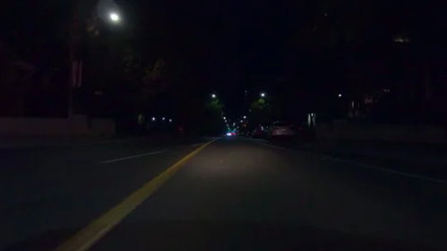

## 
<b>NIGHT-TIME IMAGE ENHANCEMENT</b>

 

### <b>Introduction </b>
We have tried to implement three Classical Vision methods to enhance the dark images and brighten them sufficiently.
<ol>

#### <li><b>Color Constancy Algorithms</b>
This method aims at equaling the illuminance of all the pixels by dividing them with the illuminance
for each channel so that every pixel can be considered to have illuminance $\{1,1,1\}$. 
These lluminance values can be computed from the following two methods:
<ol type = 'I'>
<li> <b>White Patch</b>

$I_i = max\{f_i(x, y)\}$.

<li> <b>Gray World</b>
    
$a_i = mean\{f_i (x, y)\}$ 
$I_i ≈ 2a_i$

Here $I_i$ is the illuminance for $i^{th}$ channel.
</ol>
Then, the outcome image for both algorithms is given by

$$
\begin{equation}
f_i^\prime(x,y) = \frac{f_i(x,y)}{I_i}
\end{equation}
$$

#### <b> <li>Statistical Color Transfer </b>
This method aims to recolor a given image based on the mapping b/w a source image(the image that
is to be recolored) to a target image, using statistical methods. The color space used in this method is
RGB.

<!-- $$
\begin{equation}
\mu_i^S = \frac{1}{M_SN_S}\sum^{M_S}_{x=1}\sum^{N_S}_{y=1}S_i(x,y)

\end{equation}
$$

$$
\begin{equation}
\mu_i^T = \frac{1}{M_TN_T}\sum^{M_T}_{x=1}\sum^{N_T}_{y=1}T_i(x,y)
\end{equation}
$$

$$
\begin{equation}
\sigma_i^S = \sqrt{\frac{1}{M_SN_S}\sum_{x=1}^{M_S}\sum_{x=1}^{N_S}(S_i(x,y) - \mu_i^S)^2}
\end{equation}
$$

$$
\begin{equation}
\sigma_i^T = \sqrt{\frac{1}{M_TN_T}\sum_{x=1}^{M_T}\sum_{x=1}^{N_T}(T_i(x,y) - \mu_i^T)^2}
\end{equation}
$$ -->

The output pixel value for each pixel is calculated as

$$
\begin{equation}
O_i(x,y) = \frac{\sigma_i^T}{\sigma_i^S}(S_i(x,y) - \mu_i^S) + \mu_i^T
\end{equation}
$$

#### <b> <li>Bright/Dark Channel Prior </b>

This method aims at developing a transmission map for the dark images based on the bright Channel Prior.
Further it proposes to perform a correction in the obtained transmission map with the help of dark channel prior of the parts of the image which are extremely bright due to the presence of some light source.
This transmission map thus obtained is used to get the reflectance of the scene which is considered as the enhanced imgae.

A Gamma Correction is proposed to enhance the darker parts of the image more as compared to the brighter parts.

For this, all pixels were scaled down to (0,1) and the following equation was used:
$$
\begin{equation}
O_i(x,y) = (I_i(x,y))^\gamma 
\end{equation}
$$

Here $\gamma\in (0,1)$. For this purpose $\gamma$ was taken to be 0.8. 

 

### <b>Results</b>
 

 Original Image

 

 &nbsp;&nbsp;&nbsp;&nbsp;&nbsp; 

 White Patch &nbsp;&nbsp;&nbsp;&nbsp;&nbsp;&nbsp;&nbsp;&nbsp;&nbsp;&nbsp;&nbsp;&nbsp;&nbsp;&nbsp;&nbsp;&nbsp;&nbsp;&nbsp;&nbsp;&nbsp;&nbsp;&nbsp;&nbsp;&nbsp;&nbsp;&nbsp;&nbsp;&nbsp;&nbsp;&nbsp;&nbsp;&nbsp;&nbsp; Gray World

 

 &nbsp;&nbsp;&nbsp;&nbsp;&nbsp; 

&nbsp;&nbsp;&nbsp;&nbsp;&nbsp;&nbsp;&nbsp;&nbsp&nbsp;&nbsp;&nbsp;&nbsp;&nbsp;&nbsp;&nbsp;&nbsp;&nbsp;&nbsp;&nbsp;&nbsp;Reference Image &nbsp;&nbsp;&nbsp;&nbsp;&nbsp;&nbsp;&nbsp;&nbsp;&nbsp;&nbsp&nbsp;&nbsp;&nbsp;&nbsp;&nbsp; Statistical Color Transfer
 
 

 Bright/Dark Channel Prior

